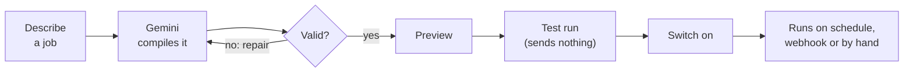
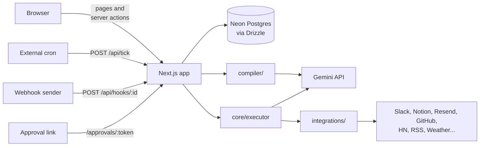

# Agent Desk


Describe a recurring job in plain English and get a workflow you can read,
test and schedule. For example:

```
"Every hour, check Hacker News for mentions of Linear and send me anything
 important on Slack. Ask me before posting if it's urgent."
```

becomes a five-step workflow: fetch, filter, summarise, ask for approval, post.
You review it before saving, run it as a test (nothing is sent), then switch it
on.

## Features

- **Plain English in, readable workflow out.** Gemini compiles the request into
  a JSON spec that is checked against the integration catalog before you see it.
- **Deterministic runs.** A plain executor replays the saved spec. The model
  only writes the text inside summary steps, never which steps run.
- **Test runs** do every read but send nothing, so you can see real output first.
- **Human approval** steps pause a run and post a link to Slack. Approve, edit
  or reject from any device.
- **Schedules, webhooks and manual runs**, with a live run inspector showing
  each step's input, output, prompt and timing.
- **Ten integrations** with no OAuth: Hacker News, Lobsters, Dev.to, Bluesky,
  RSS, GitHub, Weather, Slack, Resend and Notion.
- **Accounts** with per-user encrypted credentials, 25 runs per user per day,
  and "sign out of all devices".
- Light, dark and system themes.

New accounts start with six agents, each with ready-made workflows:

| Agent | What it does |
|---|---|
| Personal Assistant | Keeps track of what needs doing and surfaces it at the right time |
| Market Researcher | Watches the market and reports what changed |
| Social Media Marketer | Finds what is worth writing about and drafts it |
| Daily Briefer | Starts each day with the local weather and the news that matters |
| Trend Spotter | Finds what several developer communities are talking about at once |
| News Monitor | Tracks a topic across news outlets and research papers |

## How it works

### From a sentence to a running workflow



The LLM writes the workflow definition once. After that a plain executor
replays it on every run, so fetched content can change what a summary says but
can't add a step or change where results are sent. That keeps prompt injection
contained to the text of a summary.

### Architecture



```
core/
  spec.ts         workflow schema
  executor.ts     runs a spec step by step (start here)
  resolve.ts      {{template}} resolution, own properties only, no eval
  conditions.ts   structured filter conditions
  tick.ts         claims due workflows and runs them
  approvals.ts    pause, notify, decide
  steps/          one handler per step type
integrations/
  define.ts       action contract
  registry.ts     catalog used by both the executor and the compiler prompt
  hackernews, lobsters, devto, bluesky, rss, github, weather, slack, resend, notion
compiler/
  prompt.ts       system prompt, built from the registry
  compile.ts      call, normalise, validate, retry, give up
  validate.ts     checks the JSON schema can't express
  fixtures.ts     17 example requests with expected structure
lib/              sessions, quota, encryption, Gemini client, setup rules
app/              pages, server actions and API routes
components/       UI
```

Each action declares its parameters once as a Zod schema. The same schema
validates arguments at run time and describes the action to the compiler, so the
two can't drift. Adding an integration means one new file and one line in
`registry.ts`.

### LLM

Everything runs on Gemini (`lib/llm/gemini.ts`), with `responseJsonSchema` for
constrained output. The compiler uses thinking flash models and AI steps use
flash-lite. Each tier tries models from an ordered list: retry on 503/429, skip
on 404, fail on 400. Override the lists with `GEMINI_COMPILER_MODELS` and
`GEMINI_SUMMARY_MODELS`.

Every reply is still validated with Zod and against the registry, with one
repair attempt for mistakes like an unknown action or a reference to a step
that hasn't run yet.

### Scheduling

Vercel Cron on the Hobby plan only runs daily, so scheduling goes through
`POST /api/tick`, which claims due workflows in one statement:

```sql
UPDATE workflows
SET next_run_at = now() + (everyMinutes * interval '1 minute')
WHERE id IN (
  SELECT id FROM workflows WHERE enabled = 1 AND next_run_at <= now()
  ORDER BY next_run_at LIMIT 5 FOR UPDATE SKIP LOCKED
)
RETURNING id
```

Two ticks can't claim the same workflow, and it works over Neon's HTTP driver,
which has no interactive transactions. An open dashboard calls the tick every
five seconds. In production, point an external cron at `/api/tick` with
`TICK_SECRET` so workflows run without a tab open.

## Getting started

Requires Node 20.9+, a Postgres database ([Neon](https://neon.tech) has a free
tier) and a [Gemini API key](https://aistudio.google.com/apikey).

```bash
git clone https://github.com/PrajwatSrivastava/Agent-Desk---AI-Workflow.git
cd Agent-Desk---AI-Workflow
npm install
cp .env.example .env.local     # then fill it in
npm run keygen                 # prints an ENCRYPTION_KEY
npm run db:push                # create tables
npm run dev                    # open http://localhost:3000 and create an account
```

After signing up, open **Connections** from the account menu to add Slack,
Notion, Resend or GitHub. Each key is checked against the live service before
it's saved.

| Variable | Required | Notes |
|---|---|---|
| `DATABASE_URL` | yes | Postgres connection string |
| `GEMINI_API_KEY` | yes | free tier available |
| `GEMINI_COMPILER_MODELS`, `GEMINI_SUMMARY_MODELS` | no | comma-separated model fallback lists |
| `ENCRYPTION_KEY` | yes | 64 hex chars from `npm run keygen` |
| `RESEND_FROM` | for email | sender address on a domain verified in Resend |
| `APP_URL` | no | base URL for approval links; defaults to `VERCEL_URL`, then localhost |
| `DEMO_MODE` | no | treats schedule units as seconds, for demos |
| `TICK_SECRET` | in production | bearer token for `/api/tick` |

### Scripts

```bash
npm run dev         # start the app on http://localhost:3000
npm run db:push     # create or update the database tables
npm run fixtures    # compile 17 sample requests on Gemini, report pass rate and cost
npm run typecheck
npm run lint
```

## Integrations

No OAuth: each integration takes a pasted key or nothing.

| App | Auth | Notes |
|---|---|---|
| Hacker News | none | Algolia search API |
| Lobsters, Dev.to, Bluesky | none | public feeds and search |
| Weather | none | Open-Meteo forecast and geocoding |
| RSS | none | some sites block datacenter IPs. Feed URLs can only reach the public internet (private and metadata addresses are refused, including after redirects) |
| GitHub | token (optional) | raises the 60 requests/hour unauthenticated limit |
| Slack | incoming webhook | the Connections page links to a pre-filled Slack app setup |
| Resend | API key | without a verified domain it only delivers to your own Resend address |
| Notion | personal access token | `Notion-Version: 2026-03-11` |

Everything that belongs to an integration (the key, the Notion page, the email
recipient) is set once on the Connections page and shared by all agents. An
agent only asks for its own values, such as a city or a topic. Until a
workflow's setup is complete, Run and the on/off switch are disabled, and the
server refuses them too. Test runs only need the agent's values, since they
send nothing.

## Accounts and security

- Every page and server action loads the signed-in user first, and every id
  from the browser is looked up together with that user (`lib/access.ts`).
  Another user's data looks the same as missing data.
- Runs load only their owner's connections.
- Credentials are encrypted with AES-256-GCM, with the user id and app name as
  authenticated data, so a ciphertext copied to another row won't decrypt.
  Secrets are never sent to the browser; the UI shows a mask.
- Sessions are stored server-side as token hashes, in an HttpOnly, SameSite=Lax
  cookie. Signing out deletes the session; "Sign out of all devices" deletes
  every session for the account. Passwords use scrypt.
- Approvals are recorded with a conditional update, so a double click or two
  devices can't approve twice or resume a run twice.
- Each user gets 25 workflow runs per day (any kind), reset at their local
  midnight, enforced with an atomic upsert in the executor.
- Approval links, webhook triggers and `/api/tick` work without a session
  because each carries its own secret.

## License

[MIT](LICENSE) © 2026 Prajwat Srivastava

Weather data by [Open-Meteo.com](https://open-meteo.com/) (CC BY 4.0). Its free
API is for non-commercial use.
