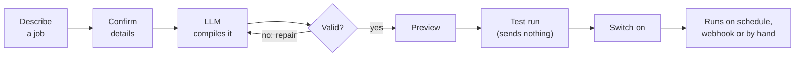
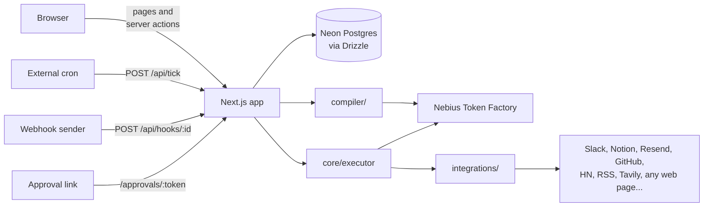

# Agent Desk


[](https://agent-desk-ai-workflow.vercel.app/)

**Live app: [agent-desk-ai-workflow.vercel.app](https://agent-desk-ai-workflow.vercel.app/)**
(sign up with any email to try it)

Describe a recurring job in plain English and get a workflow you can read,
test and schedule. For example:

```
"Every hour, check Hacker News for mentions of Linear and send me anything
 important on Slack. Ask me before posting if it's urgent."
```

becomes a five-step workflow: fetch, filter, summarise, ask for approval, post.
Before building anything it checks the details with you (where results go, how
often, and anything the request leaves open). You review the workflow before
saving, run it as a test (nothing is sent), then switch it on.

## Features

- **Plain English in, readable workflow out.** An open model on Nebius Token
  Factory compiles the request into a JSON spec that is checked against the
  integration catalog before you see it.
- **It asks before it builds.** A vague request like "give me 5 fellowship
  deadlines related to AI safety" gets a short card of questions first: which
  ones, where to send them, how often, whether to ask before sending. Best
  guesses are pre-selected, so a clear request takes one click.
- **Web pages and web search.** Read any public page or listing, fall back to
  a reader service for JavaScript-heavy sites, or search the web with Tavily.
  Results are cleaned, deduplicated, date-filtered and formatted by plain code
  before they're posted.
- **Deterministic runs.** A plain executor replays the saved spec. The model
  only writes the text inside summary steps, never which steps run.
- **Test runs** do every read but send nothing, so you can see real output first.
- **Human approval** steps pause a run and post a link to Slack. Approve, edit
  or reject from any device.
- **Schedules, webhooks and manual runs**, with a live run inspector showing
  each step's input, output, prompt and timing.
- **Twelve integrations** with no OAuth: Hacker News, Lobsters, Dev.to, Bluesky,
  RSS, GitHub, Weather, Tavily, Web, Slack, Resend and Notion, plus a built-in
  list cleaner.
- **Accounts** with per-user encrypted credentials, 25 runs per user per day,
  and "sign out of all devices".
- Light, dark and system themes.

New accounts start with six agents, each with ready-made workflows:

| Agent | What it does |
|---|---|
| Personal Assistant | Keeps track of what needs doing and surfaces it at the right time |
| Market Researcher | Watches the market and reports what changed |
| Social Media Marketer | Finds what is worth writing about and drafts it |
| Daily Briefer | Starts each day with the local weather and the news that matters |
| Trend Spotter | Finds what several developer communities are talking about at once |
| News Monitor | Tracks a topic across news outlets and research papers, and searches the web for upcoming deadlines |

## How it works

### From a sentence to a running workflow



The LLM writes the workflow definition once. After that a plain executor
replays it on every run, so fetched content can change what a summary says but
can't add a step or change where results are sent. That keeps prompt injection
contained to the text of a summary.

The confirmation step is a fast call to a small model. It restates the job in one
line, asks up to three questions about what to fetch or keep, and adds three
fixed ones (destination, schedule, approval). The answers go to the compiler as
"confirmed details", which override anything it would otherwise guess. If the
call fails, only the fixed questions are shown, so you're never stuck.

### Architecture



```
core/
  spec.ts         workflow schema
  executor.ts     runs a spec step by step (start here)
  resolve.ts      {{template}} resolution, own properties only, no eval
  conditions.ts   structured filter conditions
  tick.ts         claims due workflows and runs them
  approvals.ts    pause, notify, decide
  steps/          one handler per step type
integrations/
  define.ts       action contract
  registry.ts     catalog used by both the executor and the compiler prompt
  http.ts         outbound requests: timeouts, public-address guard, robots.txt
  web-extract.ts  HTML to clean text, links, tables and list entries
  data.ts         tidy_list: clean, filter, dedupe, sort and format a list
  hackernews, lobsters, devto, bluesky, rss, github, weather, tavily, web,
  slack, resend, notion
compiler/
  clarify.ts      questions to confirm before compiling
  prompt.ts       system prompt, built from the registry
  compile.ts      call, normalise, validate, retry, give up
  validate.ts     checks the JSON schema can't express
  fixtures.ts     23 example requests with expected structure
lib/              sessions, quota, encryption, LLM clients, setup rules
app/              pages, server actions and API routes
components/       UI
```

Each action declares its parameters once as a Zod schema. The same schema
validates arguments at run time and describes the action to the compiler, so the
two can't drift. Adding an integration means one new file and one line in
`registry.ts`.

### LLM

Everything runs on open models served by [Nebius Token Factory](https://tokenfactory.nebius.com)
(`lib/llm/nebius.ts`), an OpenAI-compatible API, with `response_format:
json_schema` for constrained output. Every call goes through one function,
`generateObject`, which returns JSON checked against a Zod schema.

The compiler uses DeepSeek V4 Pro (about 5 s and $0.015 a compile), then
DeepSeek V4 Flash and Qwen3-235B as fallbacks; put Flash first to build for
about $0.001 at 10-30 s. AI steps and the confirmation card use Qwen3-235B
Instruct, then Qwen3-30B. Only models tagged `structured_outputs` in the Nebius
catalog are used.

Each tier tries models from an ordered list: retry on 429 and 5xx, skip a model
that's missing or times out, and stop at once on a refused key or an empty
balance (Nebius returns 402), with a message saying what to do. Override the
lists with `NEBIUS_COMPILER_MODELS` and `NEBIUS_SUMMARY_MODELS`.

Nebius decodes JSON in schema order and doesn't show the schema to the model,
so the compiler's schema is also sent in its prompt, and schema fields are
declared in the same order as the prompt's worked examples. The approval
answer confirmed on the card is checked against the spec, because a missing
`when` would turn "ask me if it's urgent" into a pause on every run.

Every reply is still validated with Zod and against the registry, with one
repair attempt for mistakes like an unknown action or a reference to a step
that hasn't run yet.

### Scheduling

Vercel Cron on the Hobby plan only runs daily, so scheduling goes through
`POST /api/tick`, which claims due workflows in one statement:

```sql
UPDATE workflows
SET next_run_at = now() + (everyMinutes * interval '1 minute')
WHERE id IN (
  SELECT id FROM workflows WHERE enabled = 1 AND next_run_at <= now()
  ORDER BY next_run_at LIMIT 5 FOR UPDATE SKIP LOCKED
)
RETURNING id
```

Two ticks can't claim the same workflow, and it works over Neon's HTTP driver,
which has no interactive transactions. An open dashboard calls the tick every
five seconds. In production, point an external cron at `/api/tick` with
`TICK_SECRET` so workflows run without a tab open.

## Getting started

Requires Node 20.9+, a Postgres database ([Neon](https://neon.tech) has a free
tier) and a [Nebius Token Factory](https://tokenfactory.nebius.com) API key.
Sign-up needs a bank card and includes $1 of trial credit; building a workflow
costs about $0.015, and an AI step during a run $0.0003 to $0.003 depending on
how much text it reads.

```bash
git clone https://github.com/PrajwatSrivastava/Agent-Desk---AI-Workflow.git
cd Agent-Desk---AI-Workflow
npm install
cp .env.example .env.local     # then fill it in
npm run keygen                 # prints an ENCRYPTION_KEY
npm run db:push                # create tables
npm run dev                    # open http://localhost:3000 and create an account
```

After signing up, open **Connections** from the account menu to add Slack,
Notion, Resend, GitHub or Tavily. Each key is checked against the live service
before it's saved.

| Variable | Required | Notes |
|---|---|---|
| `DATABASE_URL` | yes | Postgres connection string |
| `NEBIUS_API_KEY` | yes | from tokenfactory.nebius.com |
| `NEBIUS_COMPILER_MODELS`, `NEBIUS_SUMMARY_MODELS` | no | comma-separated model fallback lists |
| `ENCRYPTION_KEY` | yes | 64 hex chars from `npm run keygen` |
| `RESEND_FROM` | for email | sender address on a domain verified in Resend |
| `APP_URL` | no | base URL for approval links; defaults to `VERCEL_URL`, then localhost |
| `JINA_API_KEY` | no | raises the Jina Reader limit for JavaScript-heavy pages; works without one |
| `DEMO_MODE` | no | treats schedule units as seconds, for demos |
| `TICK_SECRET` | in production | bearer token for `/api/tick` |

### Scripts

```bash
npm run dev         # start the app on http://localhost:3000
npm run db:push     # create or update the database tables
npm run fixtures    # compile 23 sample requests, report pass rate and cost
npm run check-web   # offline tests for the page extractor and list cleaner
npm run typecheck
npm run lint
```

## Integrations

No OAuth: each integration takes a pasted key or nothing.

| App | Auth | Notes |
|---|---|---|
| Hacker News | none | Algolia search API |
| Lobsters, Dev.to, Bluesky | none | public feeds and search |
| Weather | none | Open-Meteo forecast and geocoding |
| RSS | none | some sites block datacenter IPs. Feed URLs can only reach the public internet (private and metadata addresses are refused, including after redirects) |
| GitHub | token (optional) | raises the 60 requests/hour unauthenticated limit |
| Web | none | reads any public page or listing; see below |
| Tavily | API key | web search for jobs with no URL; the free plan has 1,000 searches a month, no card |
| Data | none | `tidy_list` cleans and formats lists; no network |
| Slack | incoming webhook | the Connections page links to a pre-filled Slack app setup |
| Resend | API key | without a verified domain it only delivers to your own Resend address |
| Notion | personal access token | `Notion-Version: 2026-03-11` |

Everything that belongs to an integration (the key, the Notion page, the email
recipient) is set once on the Connections page and shared by all agents. An
agent only asks for its own values, such as a city or a topic.

Every key is checked against the live service before it's saved (a Slack
webhook must post a test message and get Slack's `ok` back). Until a
workflow's setup is complete, Test run, Run and the on/off switch are disabled.
The same check runs on the server at the start of every run, whatever started
it, so setup that breaks later is caught too: a connection removed, or a key
the service starts refusing (a 401 or 403 marks it "Needs fixing" until it's
saved again). A scheduled workflow caught this way is switched off, with a
failed run saying why, instead of failing at every interval.

### Web pages and search

`web.read_page` returns a page's main text, links and tables; `web.list_items`
returns the entries of a listing page (title, link, date, snippet). Both run in
plain code:

1. Fetch the page through the same public-address guard as RSS, honour
   robots.txt, and decode its charset. PDFs and images are refused.
2. Strip scripts, menus, cookie bars, footers and sidebars, then pick the main
   content block.
3. Find the entries of a listing as the largest group of repeated blocks or
   links that share a URL shape, skipping tag links, vote buttons and author
   names.
4. If the page came back nearly empty (it needs JavaScript) or blocked us,
   retry once through [Jina Reader](https://jina.ai/reader), which renders it.

When there's no URL, `tavily.search` finds pages and can include each page's
text. A typical chain for "fellowship deadlines" is: search, have an AI step
extract `{name, organisation, deadline, url}` records, then `data.tidy_list`
drops entries without a link, keeps upcoming deadlines, removes duplicates,
sorts, keeps the first five and writes one line per entry. Slack gets that
text, never raw JSON.

Known limits: runs don't remember earlier results, so a daily job can repeat
an entry; there is no loop over each search result (use the page text option
instead); Jina's keyless limit is per IP, so on shared hosting it's best effort.

## Accounts and security

- Every page and server action loads the signed-in user first, and every id
  from the browser is looked up together with that user (`lib/access.ts`).
  Another user's data looks the same as missing data.
- Runs load only their owner's connections.
- Credentials are encrypted with AES-256-GCM, with the user id and app name as
  authenticated data, so a ciphertext copied to another row won't decrypt.
  Secrets are never sent to the browser; the UI shows a mask.
- Sessions are stored server-side as token hashes, in an HttpOnly, SameSite=Lax
  cookie. Signing out deletes the session; "Sign out of all devices" deletes
  every session for the account. Passwords use scrypt.
- Approvals are recorded with a conditional update, so a double click or two
  devices can't approve twice or resume a run twice.
- Each user gets 25 workflow runs per day (any kind), reset at their local
  midnight, enforced with an atomic upsert in the executor.
- Approval links, webhook triggers and `/api/tick` work without a session
  because each carries its own secret.

## License

[MIT](LICENSE) © 2026 Prajwat Srivastava

Weather data by [Open-Meteo.com](https://open-meteo.com/) (CC BY 4.0). Its free
API is for non-commercial use.
